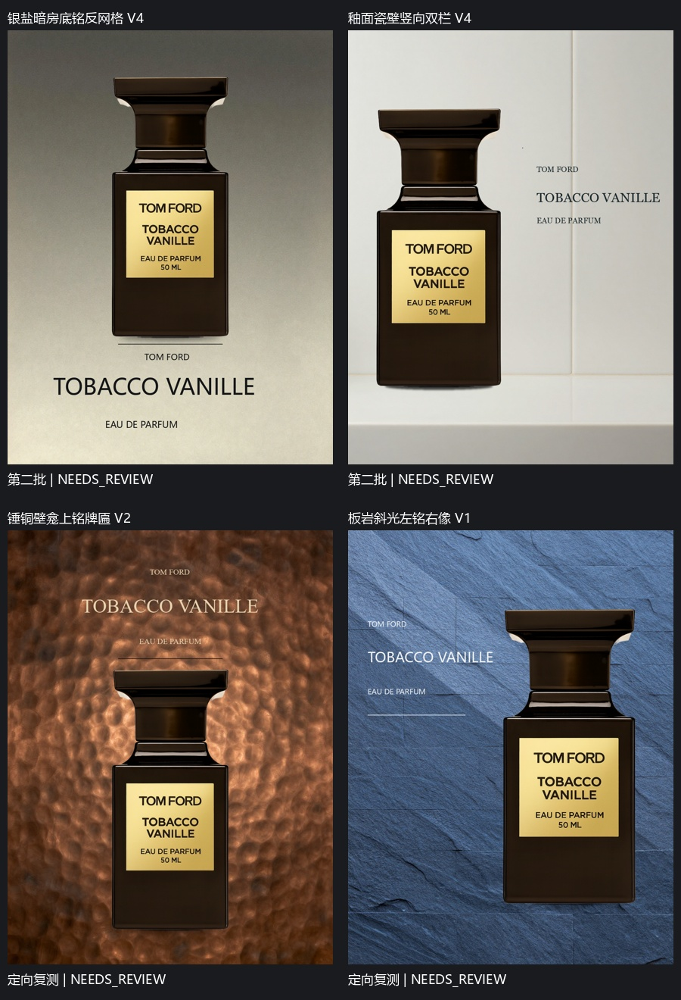
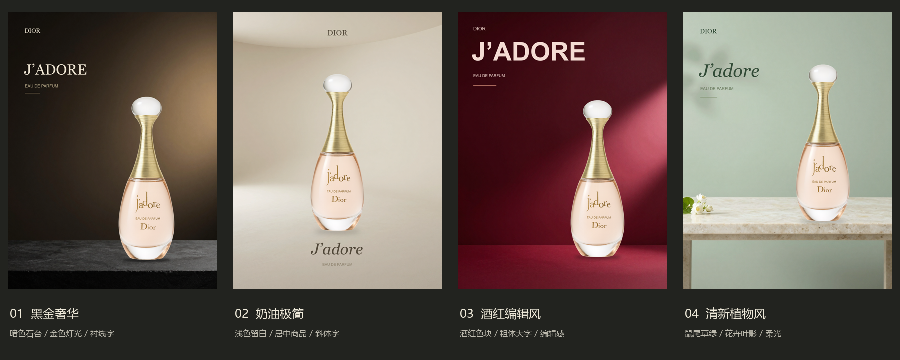
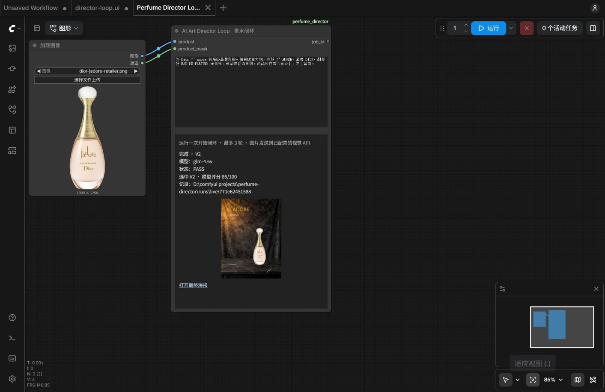

# Perfume Director — 最小闭环 v0.1

只做香水，100 张广告/商业静物参考，每次由视觉模型重新规划四个方向。没有 LoRA、向量数据库或 agent 框架。真实闭环以质量为目标，单方向渲染预算可设 1～12 版；视觉模型示例配置为 5 版，预算耗尽仍未达标就保留 NEEDS_REVIEW。

流程：参考分析 → Design KB → Director 输出 PosterSpec → ComfyUI 合成 → Critic 看成品、商品和 3 张参考 → 校验修改 → 下一版。

## 100张参考与15款商品测试（2026-10-02）

15款真实透明商品图已准备，覆盖细长瓶、宽三角瓶、星形瓶、鞋形、双环、透明玻璃与不透明瓶体。输入与来源见 `assets/products/test-products-15.json`；这是15款不同商品的视觉覆盖，不是声称15种互斥香调分类。图片保留原始字节，不重新绘制瓶身。

新增能力：商品视觉观察随 Director/Critic 传递；背景接收实际合成区域与文字留白坐标；平面图形与摄影场景区分处理；标题支持字距、自动换行、行距与对齐；装饰线可由Critic修改；接触阴影从瓶底alpha轮廓测量，并支持宽度微调。宽瓶按实际宽高比限制最大尺寸；规划修复收到真实碰撞坐标。

首轮15款均已尝试：8款完成四方向，7款失败；补测已补齐星形瓶、三角瓶与双环瓶，目前11款具有完整四方向，共44个选中海报，均为 NEEDS_REVIEW。初次补测中5款遇到403；双环瓶逐款重试已成功，其余4款正在单并发恢复。首轮每方向最多两版，用于广泛发现问题，不能据此宣称已稳定或商业质量通过。见 [合并总览](samples/matrix/perfume15-overview-20261002/gallery.html)、[首轮报告](samples/matrix/perfume15-100refs-20261002/REPORT.md)及各批证据。预览为JPEG副本，原始PNG与预览SHA分别保存；原始完整运行位于本机 `runs/`。

运行批量测试（先启动ComfyUI并配置API环境变量）：

```powershell
python test_product_matrix.py --tag my-test --rounds 2 --workers 2 --wait-for-100
python matrix_report.py --tag my-test
```

同名tag默认跳过已完成商品；复测修复请使用新tag，以保留旧失败证据。可加 `--ids prada-paradoxe mugler-angel` 只复测特定商品。常规ComfyUI入口仍每次输入一款商品、生成四个新方向。

Windows 长时间批量运行建议使用独立后台进程，避免终端关闭中断：

```powershell
.\start_comfy.ps1
.\launch_matrix.ps1 -Tag my-test -Rounds 2 -Workers 1
```

`launch_matrix.ps1` 通过 Windows WMI 创建隐藏进程，使批次独立于调用它的会话；`run_matrix.ps1` 是其内部启动入口，单独调用时仍可能随会话中断。电脑关机或服务停止仍会中断。进度保存在 `runs/matrix/my-test/`，日志位于 `runtime/matrix-my-test.stdout.log`。意外停止后再次运行同名 tag，可复用已完成方向；中断中的方向重新渲染，旧文件保留。运行中重复启动会被拒绝。不要在批量生成期间重启 ComfyUI。

首次实图检查发现数值坐标可能被背景模型画成文字，因此后续版本把背景位置提示改为自然语言区域，精确坐标仍用于确定性合成。当前已启动批次保留原引擎快照，其结果不能算作这项修复的验证。

后续修复与证据：

- [坐标泄漏的同构图真实复测](samples/matrix/coordinate-leak-fix-20261002/REPORT.md)：相同 Spec 和种子，修复后不再出现该例中的坐标文字，仍是 NEEDS_REVIEW。
- 参考池至少保留两张带广告排版的作品，每个方向在有合适参考时至少选一张；商品标签不算广告文字层级。规划使用 R1～R8 短编号，避免长引用 ID 抄错导致整批中止。
- [鞋形瓶多支撑点回归](samples/matrix/multiple-support-fix-20261002/REPORT.md)：鞋头和鞋跟分别测量接触位置；已完成本地合成对照，尚需完整 ComfyUI 补测。
- 越界标题先平移回安全区域再检查碰撞，不直接缩成很小的字。双环瓶的真实失败方案回放保留64px标题并通过几何校验。
- [背景图形的真实两轮验证](samples/matrix/deterministic-graphics-20261002/REPORT.md)：Critic 给出圆形坐标和尺寸，ComfyUI 按命令重绘。初始迁移由对话指导完成，之后的评审和修改为真实千问调用；仍未通过审美验收。

当前116项自动检查通过，只证明对应程序行为，不证明审美通过。首轮与初次补测均已结束；后续针对服务拒绝另开单款/逐款记录，保留旧失败状态。`finish_matrix.ps1 -ReportOnly` 可持续导出已有批次的本地对比页，不发起新的生成。服务端明确报出 JSON 生成中止时有限重试；参数、权限和内容拒绝仍停止，不修改输出契约绕过。

采集辅助脚本依赖 `requirements-research.txt`。当前100张图可直接使用，不需要重新采集。参考筛选脚本中的临时抓取/批量筛选记录在本机 `runtime/`，公开逐张分析与入选来源在 `references/expansion-review/`。

## 千问与动态方向（2026-10-02）

已接通千问 `qwen3.8-max` 多图 API，默认每次重新规划四个概念，并保留商品原图。动态规划同时约束版面关系和字体类型，不能仅换色或改种子。两批实际运行、模型原始响应和失败修复见[本轮报告](samples/diversity/tobacco-vanille-20261002/REPORT.md)。

第一批四张仍是上字下瓶；增加约束后，第二批实际出现上方、下方、侧边标题与衬线/无衬线字。第二批曾部分失败，报告保留原始错误；修复后的后两方向另做两版定向复测。运行与代码检查通过不代表商业审美通过。



上排来自第二批，下面两张来自修复后的定向复测，全部 NEEDS_REVIEW。这不是一个新的完整四方向成功批次；最终 82 项代码检查通过。当前本机配置与节点已加载修复，可再次使用原 ComfyUI 工作流运行。

## 早期固定风格预览与仓库运行



已保存黑金奢华、奶油极简、酒红编辑风、清新植物风四种实际 ComfyUI 渲染样例。各目录包含 PosterSpec、背景和成品，商品使用同一张原图。这些是供选择方向的预览，不是独立视觉模型自动审核通过的最终广告。

仓库包含 100 张参考、SQLite 审美库、商品来源和四种样例；模型权重、ComfyUI 环境、缓存和本地配置不上传。参考和商品图片的权利归原权利人，来源记录随文件保留。

换机器后先安装 Python 依赖，准备现有 ComfyUI、ComfyUI-GGUF 及 workflow 中指定的模型，然后复制配置：

```powershell
python -m pip install -r requirements.txt
Copy-Item config.comfy.example.json config.local.json
Copy-Item extra_model_paths.example.yaml extra_model_paths.local.yaml
```

修改 `extra_model_paths.local.yaml` 中的插件路径；用 `start_comfy.ps1 -ComfyRoot <ComfyUI目录> -ModelsRoot <模型目录>` 指定本机路径。四风格样例由 Codex 在对话里担任 Director/Critic；独立视觉 API 的两轮实际案例见下方智谱接入记录。

重现单张样例（复用背景）：

```powershell
python guided_render.py --spec samples/jadore-four-directions/02-cream-minimal/PosterSpec.json --output runs/reproduce/cream.png --background samples/jadore-four-directions/02-cream-minimal/background.png
```

## 已准备好的审美库

当前有100张参考：保留原20张，新增80张香水广告与商业静物。新增图先批量筛选，再逐张调用千问进行独立分析，并经联系表视觉复核。SHA与感知哈希用于排除完全重复和近似重复；同一作品集与品牌设数量上限。浏览 `references/gallery.html`，来源与选择理由见 `references/sources.md`。

`kb/design_kb.sqlite3` 是 SQLite 数据库，保存图片原始字节、SHA-256、尺寸、来源网页、图片链接、类型、入选理由和结构化审美标注。图片另有文件副本按风格保存在 `references/` 下；`kb/luxury.json` 是兼容导出。动态 Director 从库中按质量、渲染适配性、构图/字体/光线差异与来源分散程度选择8张不同品牌参考，再给每个方向选3张。最新选择器在接近最佳综合分的候选中加权抽样，并降低近期重复使用的权重。固定20次抽样的覆盖从15张提高到59张，仍保证每组至少两张广告排版参考；这仅是选择器验证，见 [抽样对照](references/pool-sampling-review/REPORT.md)。

原20张保留 `analysis_origin=codex_visual_review`；新增80张为 `vision_api`，每次调用只输入一张图，记录模型、图像SHA及原始响应。重新复核原20张，有17张具有画外广告排版；新增80张中有9张，总计26张。其余主要学习摄影、材质和构图；不把瓶身标签字误称为海报排版。审美分与面积比例均是模型估计，不能视为客观评分。核对记录见 `references/expansion-review/verification.json`。

参考文件版权仍属于原权利人，数据库保留来源，商业复用授权未核实。只用于研究设计语言，不将品牌文字和成品广告直接用作你的最终海报。

`collect_references.py` 保存候选下载记录；404、403、超时和证书错误未绕过。未成功下载的候选不进入正式库。`reference_store.py` 可将审阅后的 `references/curated.json` 重新导入；已存在记录保留后续视觉 API 分析。

## 先运行演示

首次真实运行已完成，见 `samples/guided/jadore-20260930/`：商品原图 + 真实 ComfyUI 背景/合成 + Codex 逐版看图修改，共 3 版。查看[三轮对比](samples/guided/jadore-20260930/comparison.png)、[审阅报告](samples/guided/jadore-20260930/REPORT.md)和[结果记录](samples/guided/jadore-20260930/result.json)，最终选 v3；这次是对话引导模式，不是独立视觉 API 自动循环。

本机启动入口：`./start_comfy.ps1`，API 为 `http://127.0.0.1:8190`。它复用现有 ComfyUI (1) Python/GGUF 插件和共享模型，运行输出保存在项目 `runtime/`。脚本含本机路径，换机器需修改参数和 `extra_model_paths.local.yaml`。

```powershell
.\start_comfy.ps1
python guided_render.py --spec samples/guided/jadore-20260930/v3/PosterSpec.json --output runs/reproduce/poster.png --background samples/guided/jadore-20260930/v1/background.png
```

也可去掉 `--background`，按 Spec 重新生成 AI 背景。`config.local.json` 已配置本机渲染器；独立 Director/Critic 仍需填入视觉模型配置和 API 环境变量。

排查发现本机 `qwen_3_4b.safetensors` 内有 9 个非有限数值张量，会产生全黑背景；已绕开它，使用已有 `Qwen3-4B-UD-Q6_K_XL.gguf`，未下载新模型。细节与失败样本留在本轮 `diagnostics/`。新增文本条件、采样、解码数值校验与生成背景全黑检查。

商品合成现在会忽略原图的透明留边，并支持 `shadow.kind=contact` 的瓶底接触阴影和每个文字层的 `font` 字体路径。

在此目录运行（Python 3.10+）：

```powershell
python -m pip install -r requirements.txt
python poster.py demo
```

演示自动创建一个几何香水瓶示意图，以本地 Pillow 渲染 3 版。Critic 的修改和分数是**脚本预设**，只验证流程与文件留档，不代表视觉模型认为作品通过，也不证明审美提高。结果放在 `runs/demo/<id>/`。

## 直接在 ComfyUI 工作流运行闭环

已在界面点击运行并完成真实两轮：[实测报告](samples/comfyui-loop/jadore-20261001/REPORT.md)，V1 75 分未通过，自动改稿后 V2 86 分 PASS。本机工作流已另存为 `Perfume Director Loop`。



加载 `workflows/director-loop.ui.json`，工作流只有两个入口节点：

`LoadImage（透明商品 PNG，IMAGE + MASK） → AI Art Director Loop（brief）`

首次安装/更新节点时运行 `./start_comfy.ps1 -Restart`，然后打开 `http://127.0.0.1:8190`，用 Ctrl+O 导入上述 JSON。在 LoadImage 上传商品，填写 brief，点击一次“运行”。节点显示 Director、Render、Critic 阶段以及最终 PASS/NEEDS_REVIEW、选中版本和成品预览。仍需现有 `config.local.json`、视觉 API 环境变量、参考数据库、ComfyUI 模型和字体。密钥不填写在工作流里。

这是整个闭环的入口，不是只有合成器。后台协调器运行原有 `poster.run`，自动向当前 ComfyUI 提交背景/合成工作流，按照配置的渲染预算循环。入口节点立即返回 job_id，以释放 ComfyUI 单任务执行队列；若在同一个执行节点里等待自己排队的渲染，会造成死锁。节点 STRING 输出是任务 ID，最终海报由节点的后台预览显示，不作为同步 IMAGE 输出连接到 SaveImage。

视觉阶段的 ComfyUI 渲染队列可能暂时为空；以入口节点的终态为完成标志。每次手动点击运行会创建新任务，运行中禁止重复提交。刷新可恢复已保存工作流的 job_id 进度；重启服务器会中止未完成任务，需要重新运行。重启脚本只会停止 PID 与启动目录都匹配的本项目实例，并拒绝中断非空队列或正在运行的闭环。

任务状态保存在 `runtime/director-jobs/<id>/state.json`，完整运行仍保存在 `runs/live/<id>/`。预览接口只能读取对应运行目录内的 PNG，不允许任意文件路径。

## 独立视觉模型：智谱 GLM-4.6V

已完成真实独立运行：[案例报告](samples/live/jadore-20261001/REPORT.md)。开启推理的运行 V1 为 84 分但未通过，模型修改接触阴影后 V2 为 89 分并 PASS；完整 API 调用记录随样例保存。另保留三轮 NEEDS_REVIEW 和格式中止记录。这是单商品单方向验证，该历史案例未涉及四方向竞争；当前四方向能力见后续记录。

配置示例：`config.zhipu.example.json`。通过 [智谱官方 Chat Completions 接口](https://docs.bigmodel.cn/api-reference/模型-api/对话补全) 发送多张图片，Director 收到商品图和 3 张参考，Critic 收到成品、原商品图和同样的 3 张参考。图片会发送到 `open.bigmodel.cn`，并产生账号对应的 API 用量。

```powershell
Copy-Item config.zhipu.example.json config.local.json
$env:ZHIPU_API_KEY = '你的智谱 API key'
.\start_comfy.ps1
python poster.py run --config config.local.json --product assets/products/dior-jadore-retailer.png --brief "为 Dior J’adore 做一张高级品牌展示海报，标题 J’ADORE，品牌 DIOR，副标题 EAU DE PARFUM，无价格、新品或促销声明。"
```

密钥只从环境变量读取，不写入配置、日志或仓库。此示例开启 `thinking`，最多输出 8192 tokens，每次调用超时 240 秒。其他兼容接口可替换 URL、模型和环境变量名，`vision_options` 只允许推理/采样选项，不能覆盖 messages、model 或鉴权。

每次真实运行保存在 `runs/live/<id>/`。`Director-call.json` 和各版 `Critic-call.json` 保存实际返回的模型名、响应 ID、图片哈希、用量、耗时及结构化输出；不保存密钥或请求图片的 base64。单层 `answer` 包装可解包，但仍须通过原有 Spec/Critic 校验；截断响应会拒绝。`result.json` 保存版本、成品哈希和 `standalone_vision_api_used`。对比图工具只读取结果，不改写来源或评审结论：

```powershell
python build_review.py runs/live/<id>
```

Critic 额外收到合成器实际计算的商品边界、瓶底 y 和文字边界，辅助它提出具体坐标修改。这些几何数据不会自动替它作出审美判断。模型的 PASS 是模型评审结果，不是商业质量保证；失败或预算耗尽仍未通过则需人工复核。

## 接入真实视觉模型

```powershell
Copy-Item config.example.json config.json
$env:VISION_API_KEY = '你的 API key'
```

在 `config.json` 设置 `vision_model` 和 `vision_base_url`，需要支持图片输入和 JSON object 输出的 Chat Completions 接口。密钥只从环境变量读取。配置中的字体是 Windows 微软雅黑，可替换为本机合法可用的字体文件。

将自己认可的真实商业作品放入 `references/luxury/`，目标 20 张，至少 3 张，支持 PNG/JPEG/WebP。保留来源和选择理由到 `references/sources.md`。程序不会自动搜图，不会把生成的示意图伪装成优秀参考。

```powershell
python poster.py index --config config.json
```

逐张分析保存到 `kb/luxury.json`。v0.1 按香水适配分排序，取前 3 张供 Director/Critic 使用；暂不实现语义检索。重新 index 会重新分析，产生模型 API 费用。

## 安装 ComfyUI 合成节点

推荐使用 `start_comfy.ps1` 安装并启动；它会复制所有节点文件、前端扩展和本机 project.json。手动安装需复制 `comfy_node/` 的内容，加上根目录的 `poster.py`、`reference_store.py`、`check_background.py`，并创建 `project.json`（内容为 `{"project_root":"项目绝对路径"}`）。布局为：

```text
custom_nodes/perfume_director/
  __init__.py
  poster.py
  reference_store.py
  check_background.py
  jobs.py
  project.json
  web/director.js
```

ComfyUI 的 Python 环境需要 Pillow（以及 ComfyUI 已使用的 numpy/torch）。重启 ComfyUI 后，节点名为 `PerfumePosterSpecRender`。项目附带 `workflows/composite.api.json`，这是 API 格式，由 CLI 提交。

合成器按照 Spec 绘制背景、商品透明蒙版投影或接触阴影、商品、装饰线、Logo 文字、标题、副标题、价格。商品图保持原样，不重新生成商品。v0.1 需要你提供**已经抠好的透明 PNG**，尚未接入自动抠图。Logo 暂时是文字，尚不支持图形 Logo。

```powershell
python poster.py run --config config.json --product assets/perfume.png --brief '给这个香水做一张高级新品海报'
```

默认纯色背景，足以验证控制和真实 Critic 链路。也可以通过 `--background assets/background.png` 使用已准备的背景。设置 `background_workflow` 时，以 AI workflow 为准。

## 接入现有 Qwen 背景 workflow

从 ComfyUI 导出 **API 格式** workflow，保存到 `workflows/background.api.json`。不要把画布 UI 格式 JSON 当作 API JSON。按实际节点 ID 配置下列字段，节点编号示例仅说明格式：

```json
{
  "background_workflow": "workflows/background.api.json",
  "background_bindings": {
    "prompt": {"node": "6", "input": "text"},
    "seed": {"node": "3", "input": "seed"},
    "width": {"node": "5", "input": "width"},
    "height": {"node": "5", "input": "height"}
  },
  "background_output_node": "9"
}
```

合并这些字段到完整 `config.json`。从项目目录启动命令，使相对 workflow 路径正确。输出节点必须返回保存图片信息，例如 SaveImage；一旦背景配置错误会直接报错，不会偷偷用纯色图替代。背景 prompt 不应包含文字和商品，最终位置、文字和商品大小由 Spec 合成节点执行。

`lighting`、`palette` 是 Director 的设计意图；目前灯光须体现在 `background.prompt` 中，合成节点不会重打商品灯光。这里尚未包含 Qwen 模型文件和可直接运行的 Qwen 背景 workflow，需要以你实际安装的模型/节点为准。

## Spec 和 Critic 协议

完整模板见 `examples/PosterSpec.json`。坐标以像素为单位；商品 `x/y` 为中心、`width/height` 为忽略透明留边、保持纵横比的容纳框；文字 `x/y` 为左上角。层顺序由 `layers` 显式控制，背景必须最先、阴影必须先于商品。超出画布的商品框和文字会被拒绝。

Critic 返回 `pass`、0–100 的 `score`、`problems` 和 `changes`。修改只允许白名单字段和 `set/add/multiply`，不执行模型生成的代码。修改一次性验证，越界/非法修改拒绝并保留已产生的版本；四方向模式最多要求一次模型安全修复，不静默截断参数。下面是字段简写示意，独立视觉调用必须同时返回七项 dimensions：

```json
{"pass": false, "score": 72, "problems": [{"type":"typography","problem":"标题权重太高"}], "changes": [{"path":"title.size","op":"multiply","value":0.82}]}
```

单方向内种子保持可追踪，背景 prompt 修改时增加 revision，背景首次种子为 base seed + revision；质量重试使用明确记录的 seed offset。动态四方向另加入批次随机偏移，重复运行不沿用旧背景种子。独立视觉评审 PASS 必须七项均不低于 80、均分至少 85，且没有待处理问题/修改。渲染预算包含第一版，当前可配置 1～12 版；未通过则选优并标记 `NEEDS_REVIEW`，不会强行宣布成功。模型分数是自评，尚未经过人工标定。

每次运行保存 request、各版 PosterSpec、poster.png、Critic、最终 result。超时后 ComfyUI 任务可能还在队列中，程序不自动打断其他任务。成功案例暂只留档，尚不训练或统计 Style DNA。

## 验证

```powershell
python -m unittest discover -s tests -v
```

基础测试覆盖后台调度非阻塞、重复提交保护、重启状态恢复、预览路径边界，以及多图请求、视觉调用留档、截断拒绝、answer 包装兼容、几何辅助及非法修改拒绝、修改原子性、背景 revision、PASS 约束、提前停止、三轮上限和最佳版本选择。真实 ComfyUI + 商品原图的对话引导三轮案例已随仓库保存；独立视觉 API 的自动 Director/Critic 已新增一个两轮 PASS 案例和一个三轮 NEEDS_REVIEW 案例，详见 samples/live。

协议参考：[ComfyUI server routes](https://docs.comfy.org/development/comfyui-server/comms_routes)、[Chat Completions API](https://developers.openai.com/api/reference/resources/chat)。

### 审美评审修正（2026-10-01）

旧案例两轮只修改阴影位置，75→86 分不能证明设计已达到商业水平；模型 PASS 仅是模型判断。新版 Critic 对商品保真、构图、字体、背景、物理融合、参考质量差距、创意一致性七项分别评分；程序使用七项平均值作为总分，平均至少 85 且每项至少 80、无未解决问题才能 PASS。保留模型原总分为 reported_score。缺少维度或非法评分会拒绝，不补造评分。Director 默认强调商品主视觉、克制背景和文字关系。阈值仍不能代替人的最终审美判断。

重做样例：[暖白 J’adore 海报与真实评审记录](samples/rework/jadore-20261001/REPORT.md)。这是 Codex 指导的重做，状态为 NEEDS_REVIEW，不能宣称独立 Director 已成功。后续评审附上一版和真实文字/商品重叠计算；非法修改保留最后有效海报。该阶段 21 项测试通过。

### 每次四个独立风格

ComfyUI 中每次运行 `PerfumeDirectorLoop` 默认使用 `direction_mode: dynamic`：先识别商品文案，再由视觉模型同时看商品与按设计语言分散选择的八个不同品牌参考，规划四个新概念。模型决定商品位置/大小、文字网格/字体、配色、材料和背景叙事，程序将紧凑方案转换成 PosterSpec 后执行，保留商品原图。各方向独立渲染、评审、修改和选优，文案保持一致。每批使用新背景种子。

规划会参考最近八批设计，拒绝已有的粗粒度布局/颜色/字体组合；同批至少三个布局网格、三个背景色族、衬线与无衬线标题类型和三种材料。另外必须包含标题在商品上方、下方和侧边的空间关系，以实际渲染包围盒判断，不能只移动几像素就算新布局。Critic 修改须保持该方向的标题/商品空间关系与字体类型。这个检查只防明显重复，不保证四张成品具有足够的审美差异。非法方案仅请求一次修复，仍不安全则停止，不回退到固定风格。

节点以 2×2 卡片显示各方向的成品、分数和 PASS/NEEDS_REVIEW；点击图片打开对应文件。`COMPLETED` 表示四个方向已跑完，不代表全部通过审美评审。一个方向失败继续其余方向，部分失败为 `PARTIAL`，全失败为 `ERROR`。批次记录保存到 `runs/batches/`，每个方向各自保留原始运行目录。旧工作流刷新即可使用新版节点，或重新导入 `workflows/director-loop.ui.json` 获得更大的四图面板。

CLI 同样支持：
```powershell
python poster.py four --config config.local.json --product assets/products/dior-jadore-retailer.png --brief "四种风格的香水品牌海报，无价格或促销声明"
```

四方向串行使用同一台 ComfyUI，耗时和 API 用量比单方向增加；仍只允许一个批次运行。配置可用 `max_rounds: 1..12` 控制各方向预算，程序默认 3，智谱示例为 5。轮数不代表质量；未通过严格评审仍保留 NEEDS_REVIEW。Director 输出非法 Spec 时只允许一次带错误信息的模型修复，仍非法则该方向失败，保留记录，不伪造成功。

早期四个方向使用人工整理的起始网格。需要复现历史黑金/奶油/酒红/植物方向时，显式设置 `direction_mode: curated`；下面的旧案例均来自这一历史模式。动态模式保留排版安全检查，但不恢复人工网格，也不强制左对齐或固定色系。

最新全自动实跑：[四方向自动任务原图、原始评审和失败记录](samples/automatic-four/jadore-20261001/REPORT.md)。通过真实 ComfyUI 节点提交，无人工改 Spec 或成品。四个方向都有生成图，批次最终为 PARTIAL，未产生有效 PASS；黑金评审自相矛盾、奶油 V2 评审断连，酒红和植物未通过。该案例不能用来证明稳定商业设计质量。


### 稳定性保护

- 临时断连、超时、429 和 5xx 最多重试三次，401 等配置错误立即停止。每次请求记录耗时、返回模型、用量和尝试记录，不记录密钥。
- HTTP 400 保存可识别的服务方错误码；带错误码的拒绝直接停止，没有可识别错误码时只额外尝试一次，不反复重试或改写输入绕过明确拒绝。
- 矛盾的 PASS（仍有问题或修改）保守降为未通过；缺失评审维度会要求模型重新看图一次，仍无有效评审则保留海报并标记未评审，不补造分数。
- 四方向先检查实际商品、文字与安全边距；动态模式不安全的布局交回模型修复，历史 curated 模式才允许恢复人工安全网格。Critic 危险修改保持原子拒绝，并最多要求一次安全修复。
- 文字与商品至少留出画布高度/宽度 2.5% 的间距；动态模式还拒绝文字之间的重叠，不强制统一对齐。历史 curated 模式检查固定对齐组。
- 字体须覆盖实际文案的全部字形；Director 会回退到配置的字体并记录修改，仍缺字则拒绝，不生成乱码方框。
- AI 背景检查常量图与白边，历史 curated 模式另外检查固定色系。失败最多重新生成两次；动态模式继续使用模型规划的背景提示词，不改成固定模板。仍失败采用显式标记的程序备用背景，禁止因此记为 PASS。此检查只防明显错误，不判断商业审美。
- 文字与实际背景的平均对比度不足时，Director 执行前调整字色，保存修改记录；不改文案和商品。背景本身与商品的光线融合仍需要看图验收。

默认智谱示例使用 GLM-4.6V、关闭深度思考、低随机性与 1280 像素多图输入。可在 config.local.json 调整；运行后仍须检查四张图，COMPLETED 不等于商业质量通过。Background-audit.json 标明生成尝试、备用背景和文字调整；Layout-preflight.json 保存初始布局保护记录。


最新稳定性加固验收：[全部七批自动实跑与最终四张图](samples/stability/jadore-20261001/REPORT.md)。43 项检查通过；最终批次 4/4 可预览，全部确定性检查通过，审美仍全部 NEEDS_REVIEW。报告同时保留中途一次 API 失败、白边漏检和字体问题，不宣称长期或跨商品稳定性。


## 继续优化：名称一致、执行有效修改、直接比较成品

四风格批次先单独读取商品图与用户 Brief，保存 `Product-copy.json`，四个 Director 共用同一组商品名称、品牌、描述和价格字段，避免参考品牌或“香氛”占位词混入成品。无法确认的文字留空；识别结果仍需人工核实，并非品牌身份认证。

Critic 可以通过白名单选择本机已安装的 Times、Georgia、Arial、微软雅黑、Bodoni、Baskerville、Arial Narrow 和 Century Gothic；修改前验证字体存在与字符覆盖。复杂修改仍先原子校验，再请求一次模型修复。若修复失败，程序按商品、文字、阴影、背景四组保留独立安全的修改，记录 `Critic-safe-groups.json`；不安全的商品移动不会阻止有效的背景调整。相同 Spec 停止重复渲染。

Critic 同时收到本轮 `Background-audit.json` 的文字颜色纠正，以及上一轮修改的执行/拒绝记录。浅色背景上反复要求浅色文字、反复撞瓶的移动不应被当作新改进；模型仍可能提出无效建议，程序继续校验并留档。动态模式的字体修改限制在原定衬线/无衬线类型内。

`compare_final_versions: true` 会让视觉模型直接比较本方向的已评审版本与参考作品，保存 `Selection.json`，不向模型提供各版分数。选择可以回退到较早或较低分的作品；比较失败则明确记录并回退到分数选择。这是相对选优，**不能赋予 PASS**，仍使用原来的七维严格门槛。

历史 curated 模式限定连续摄影棚背景；动态模式可选择图形、建筑或材质背景，仍拒绝展台/台面/底座、重复商品、人物、摄影设备和生成文字。渲染器保持商品原图，因此强逆光、透光与真实环境反射仍是当前能力边界；不能靠提高评审分数掩盖这种差距。


2026-10-01 质量迭代：Critic 额外看到按商品几何位置裁切、等比例放大的 `Contact-detail.png`，辅助识别细小的瓶底接触阴影。奶油方向强制保持文字光学居中，接触阴影垂直偏移限制为 -2～0，避免 Critic 将左上角误设到画布中心或移动阴影制造空隙。背景中的 softbox 词替换为光线效果描述；选图阶段也明确拒绝可见摄影设备。实际三批运行与局限见 [质量报告](samples/quality/jadore-20261001/REPORT.md)。


## 第二款商品的自动化验证

使用 Tom Ford Tobacco Vanille 透明商品图，以不包含品牌名称的通用 Brief 运行真实 ComfyUI 节点。原版植物方向因长标题与宽瓶身间距不足失败；通用排版修复后同配置复测四方向全部出图，58 项检查通过，审美状态仍全部 NEEDS_REVIEW。完整失败、修复与复测记录见 [跨商品测试报告](samples/cross-product/tobacco-vanille-20261001/REPORT.md)。这次验证仅覆盖已抠图透明 PNG，不代表任意照片均能自动处理。

千问视觉接入模板为 `config.qwen.example.json`，使用 `DASHSCOPE_API_KEY` 与阿里云百炼工作空间地址；须替换 YOUR_WORKSPACE_ID 并确认模型访问权限。本机已接通 `qwen3.8-max`，支持商品识别、多参考概念规划和成品评审。此处千问担任 Director/Critic，与上面的 Qwen 背景 workflow 是不同角色。官方接入说明：[千问视觉 API](https://help.aliyun.com/zh/model-studio/vision/)。

密钥放在当前进程或 Windows 用户环境变量中，不填入工作流或配置文件；`start_comfy.ps1` 会在当前进程缺少密钥时读取配置所指定的用户环境变量。千问模板使用 `enable_thinking: true`、`thinking_budget: 1024` 和包含推理/回复的 `max_completion_tokens: 8192`。规划温度为 0.8，评审为 0.2。该额度限制用于缩短非流式请求；过长规划曾出现断连，失败记录保留，不代表已验证长期稳定性。


更强视觉模型模板 `config.glm53.example.json` 使用本机已实际调用的 GLM-5.3-Flash，`reasoning_effort: low`、32768 输出额度及 300 秒请求超时。该模型不支持关闭思考；沿用 GLM-4.6V 的 `thinking.type: disabled` 会报错。更换模板前保留本地配置，密钥继续放在环境变量。客户端支持官方推理强度参数，并对单层 answer 中的 JSON 字符串解包，保存原始包装证据；截断或非法 JSON 继续拒绝。全部 62 项检查通过，真实四方向结果见跨商品报告。

GLM-5.3-Flash 的完整第二款商品批次已完成：4/4 出图，13 个版本均有有效 Critic，黑金 V2 为模型 PASS，其余三方向 NEEDS_REVIEW。奶油方向出现琥珀色风格漂移，酒红与植物选回首版；另有一次修改修复 JSON 无效且被拒绝。不能据此宣称稳定商业审美。原始图片、每轮 Spec、评审、修复拒绝与预览核对见跨商品报告。
