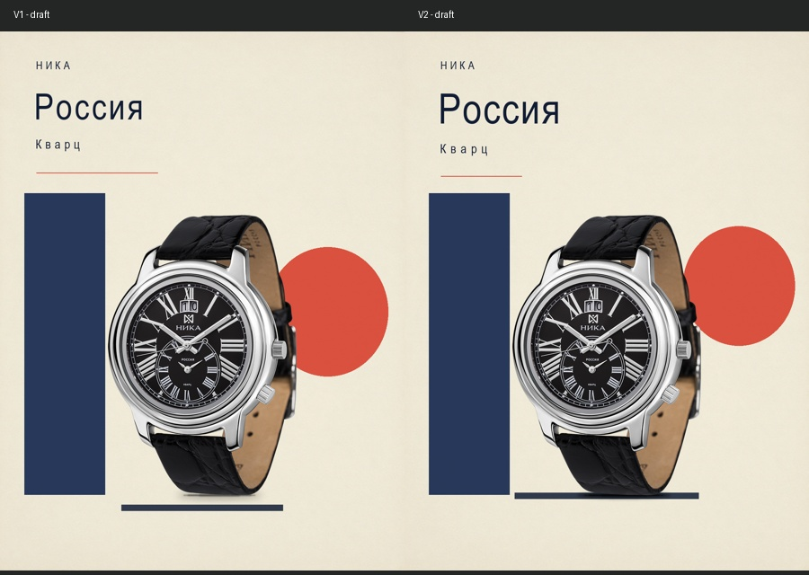

# 腕表真实自动迭代

2026-10-03，通过ComfyUI ProductDirectorLoop实际提交，千问读商品和腕表参考、规划四方向。本目录仅记录首方向前两版过程，不是四类别最终完成报告。

V1经过真实多图Critic评审，没有通过。程序按其background.shapes、标题字号/字距、副标题位置和接触阴影修改重绘V2，V2仍需评审。两版均保留实际商品原图。Critic关于圆形被画布裁切的说法与几何不符（V1右边界为1037，画布宽1080），不能把模型判断全当事实；后续仍需人工看图。

原始PNG保留在本机runs/live/e3971c76b6df。图示为JPEG副本；各版记录原始与预览哈希。完整进度和选稿见../categories-20261003/gallery.html。商业验收尚未完成。
