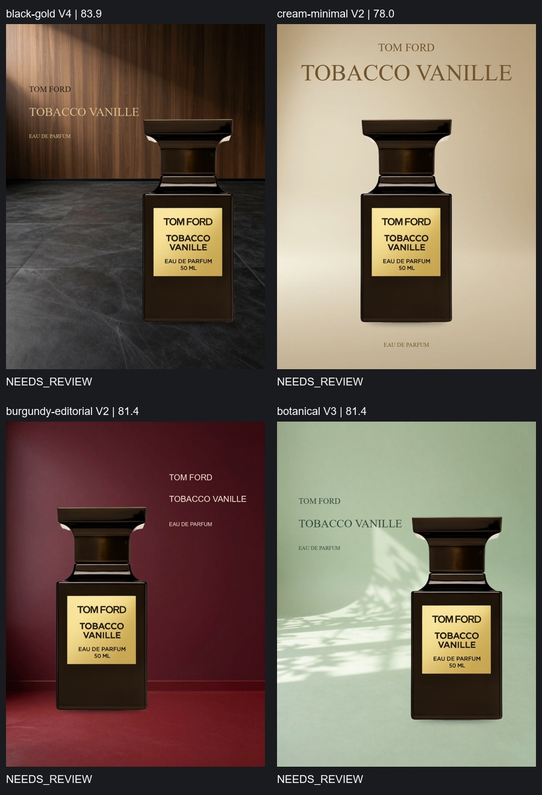
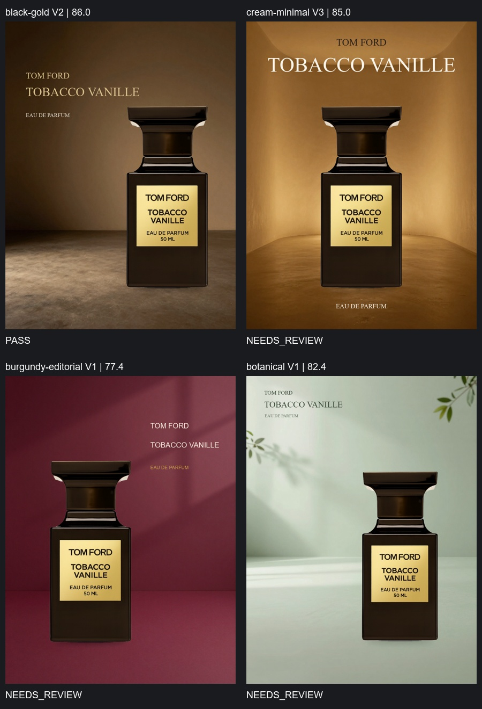

# 新商品自动化测试：Tom Ford Tobacco Vanille

本次选用公开商品图，深色方瓶、金色标签与长产品名，测试现有四方向闭环能否适应第二款香水。商品图片直接下载保留原文件，未重新生成。输入要求为已抠图的透明 PNG；本次没有验证自动抠图或任意商品照片的支持。

商品来源：[Mondo Parfum](https://mondo-parfum.de/Tom-Ford-Tobacco-Vanille-Eau-de-Parfum-30-ml/TOM-008.1)。商品图与网页标题的容量不同；只按图片识别品牌与名称，不新增容量文案，瓶上原标签保留。来源与哈希在 `assets/products/sources.json`。

## 首轮：原样跨产品测试

沿用 `5ac7322` 的模型（GLM-4.6V）、参考库、四方向网格和每方向最多五版的配置，通过 ComfyUI `PerfumeDirectorLoop` 节点自动执行。Brief 没有写 TOM FORD 或 TOBACCO VANILLE，而是让程序自行读取图片品牌与产品名称；实际得到 TOM FORD / TOBACCO VANILLE / EAU DE PARFUM，价格为空，没有沿用 Dior。

前三方向完成，植物方向在预检中失败，批次状态 PARTIAL，3/4 出图。失败原因可以重现：固定画布宽度比例只将标题缩小到 50px，未根据更宽的瓶身计算文字实际可用区域，触发 title_too_close_to_product。失败的原始 Director 响应保存在 baseline/botanical；没有人为补一张图覆盖失败。

## 通用修复与完整复测

新增两个回归检查，先在真实失败数据上重现红灯；随后让字体适配同时考虑实际瓶身边界、当前文字纵向相交、画布边界及最小安全间距。真实失败设计现在自动缩小到 47px，保留完整商品名、原瓶型及风格位置。全部 58 项检查通过。

修复涉及通用排版计算，不是为这个品牌手写一张 Spec。加载修复后的 ComfyUI 节点，使用同一份通用 Brief、同一商品原图、同一模型配置，完整重跑四方向。两轮都由模型担任 Director/Critic，没有人工修改单张 PosterSpec 或手动替代模型选图。

| 方向 | 自动渲染版本数 | 最终选择 | 模型均分 | 状态 |
|---|---:|---:|---:|---|
| black-gold | 5 | V4 | 83.9 | NEEDS_REVIEW |
| cream-minimal | 3 | V2 | 78.0 | NEEDS_REVIEW |
| burgundy-editorial | 3 | V2 | 81.4 | NEEDS_REVIEW |
| botanical | 3 | V3 | 81.4 | NEEDS_REVIEW |

复测完成 4/4 出图，全部选中版本通过确定性布局与背景检查，但严格审美评审全部为 NEEDS_REVIEW。自动化执行已在第二款透明商品图上得到验证，商业设计质量尚未通过。黑金有木墙与纹理地面，背景抢眼；奶油瓶身与底部接触感较弱；植物与酒红的真实环境光融合仍有限。模型评分未经标定，不能等同于人的审美验收。

黑金最终比较返回不存在的版本 7（实际仅 1–5），程序明确回退到分数选择 V4。保留 Selection-call.json 和 Selection.json，这次不能声称四方向均完成有效视觉选优。

## 证据

各方向保留所有成品、PosterSpec、生成背景、模型调用响应和图像摘要、Critic、修改拒绝/恢复记录与最终选择。`submission.json` 为两轮实际提交的 ComfyUI API 图与通用 Brief，`job-state.json` 为节点的最终任务状态。`verification.json` 回查文字、真实渲染几何、背景、所选文件哈希及评审失败状态。REST 预览另按 SHA-256 检查与选择结果一致，属于图片交付验证，不能证明审美达标。

## 更强视觉模型的接入与失败记录

GLM-5.3-Flash 的单图识别已实际成功，返回模型名称与请求一致。本机未配置千问密钥与百炼工作空间地址，千问模板可用但未实际接通。

首个完整 GLM-5.3-Flash 试验使用 8192 输出额度与默认推理强度：黑金 Director 耗尽额度，finish_reason 为 length；奶油生成了 V1，但六图 Critic 三次断连，共约 520 秒，没有有效评审。随后酒红 V1 已生成但评审尚未结束；在确认渲染队列为空后停止本项目测试服务，正常重启恢复将任务记为 ERROR/ServerRestarted。植物方向未开始。`glm53/interruption.json` 与 `interrupted-burgundy/` 保留中断证据，不能算完成的四方向批次。

官方模型不支持 thinking.type=disabled，实际请求得到 HTTP 400 / 1210，也留档。根据官方接口为 GLM-5.3-Flash 设置 reasoning_effort=low，输出额度增至 32768，超时配置 300 秒。单图识别 2.6 秒；已有奶油成品的六图真实评审 26.3 秒，返回有效七维评分。这是调用验证，不能替代全自动批次。

第一次低推理批次的 Product-copy 返回字符串形式的 answer 包装，原客户端没有解码，批次失败于识别契约。`glm53-low32k-copy-error/` 保留真实失败。兼容修复只接受可解析的 JSON 对象，并保留原包装；非法 JSON、数组、布尔值继续拒绝。新增回归检查先失败后修复，全部 62 项通过。

新版还明确产品名与品牌分开，并为选图候选标明图片编号和版本号的对应关系。这些是有记录的提示改动，因此新旧批次并非只改变一个模型变量的严格实验；跨模型分数也不能当作统一标尺。

官方参数来源：[GLM-5.3-Flash](https://docs.bigmodel.cn/cn/guide/models/vlm/glm-5.3-flash)、[对话补全接口](https://docs.bigmodel.cn/api-reference/模型-api/对话补全)。

## GLM-5.3-Flash 完整自动批次（2026-10-02）

任务 `dfc617e0cf7c4de4897eebe386fc9906`，真实 ComfyUI API prompt `23bb07ee-a1ee-43c7-bcf5-88db83deb17b`，批次 `5384ae8b2574`。完成 4/4，共渲染 13 个版本，无人工修改单张 Spec、成品或最终选择。黑金第二版满足原来的严格七维规则；其余三方向保留 NEEDS_REVIEW，没有降低门槛。

| 方向 | 渲染版本数 | 自动选中 | 模型均分 | 状态 |
|---|---:|---:|---:|---|
| black-gold | 2 | V2 | 86.0 | PASS |
| cream-minimal | 3 | V3 | 85.0 | NEEDS_REVIEW |
| burgundy-editorial | 4 | V1 | 77.4 | NEEDS_REVIEW |
| botanical | 4 | V1 | 82.4 | NEEDS_REVIEW |

这些分数来自新模型自评，不能与 GLM-4.6V 分数直接比较，也不能证明人的审美验收。黑金的 PASS 是模型判定；实际看图仍偏通用摄影棚场景，不能称已达到稳定商业设计质量。

四个最终版本的商品名、品牌、描述一致，价格为空；确定性排版和背景检查均通过，背景全部来自真实 ComfyUI 生成，没有备用背景。预览文件 SHA-256 与选中海报全部一致。所有 13 个版本均获得有效七维 Critic，无评审断连或未评审版本。留档 28 次模型调用，均返回 GLM-5.3-Flash；其中酒红 V4 的修改修复调用虽正常结束，但内容不是有效 JSON，程序拒绝并记录 JSONDecodeError；该版安全分组没有可执行修改，保留最后有效图片。因此不能称本批次所有 API 调用均成功。

奶油、酒红、植物的最终比较均返回有效版本号，没有出现旧模型选中不存在的 V7。酒红与植物都选回 V1：后续修改没有持续提升实际效果，程序没有凭较高分或较新版本强行选择后版。奶油因重复 Spec 停止，选中 V3；酒红 V4 没有可执行的独立安全修改，停止并保留图片；植物因重复 Spec 停止。详见实际存在的 Stop.json 与各方向修改记录。

### 尚未解决的质量问题

- 奶油极简从暖白漂移为琥珀金，Critic 偏好层次与材质却没有守住最初方向。黑金也偏暖棕色，因此四方向的差异未达到“完全不同”的理想要求。
- Critic 对请求的居中极简构图仍会泛化批评为静态，且提出不在修改白名单内的装饰要求。更强识图不能保证正确艺术指导或完全遵守执行契约。
- 成品的瓶身高光、环境反射和背景光线仍缺乏物理一致性；合成器不重打商品灯光。绿叶元素已出现在植物背景里，背景简单检查不等于完整语义或商业审美验收。
- 酒红与植物的多轮修改没有持续变好。这次只证明第二款透明商品图上的自动读取、生成、评审、修改和选优可以完成，没有验证长期成功率或所有产品类别。

当前本地模型配置保留此已完整实跑的 GLM-5.3-Flash 参数，千问接入模板保留待实际密钥与工作空间地址配置。下一项质量工作的依据是风格约束与匹配参考、有效修改率和商品光线融合，而不是继续增加轮数或提高分数。
