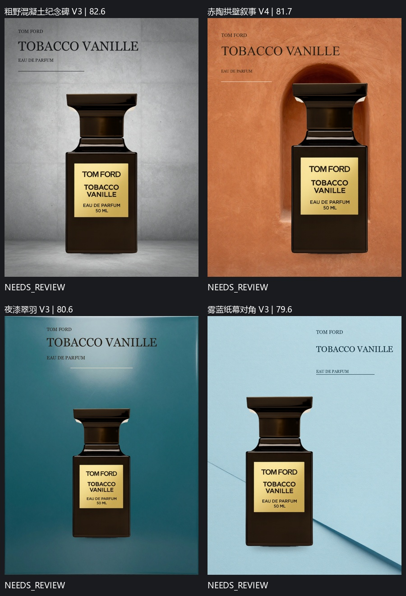

# 千问接入与动态设计方向测试

本次针对「每次都是同几个模子」修改了规划层，而非仅更换随机种子。默认四方向不再来自黑金、奶油、酒红、植物的固定列表。视觉模型看商品与六个不同品牌参考，一次规划四个新概念，程序将模型选择的坐标、比例、字体、配色和背景提示词转成 PosterSpec。各方向继续执行 ComfyUI → 视觉 Critic → 校验修改 → 再渲染 → 成品选优。

## 输入与执行约束

- 商品：Tom Ford Tobacco Vanille；使用与之前跨商品测试相同的透明原图。
- Brief：不提供品牌名称，要求读取图上真实名称，禁止价格、促销、新品承诺和新增容量文案。
- 视觉模型：实际请求 `qwen3.8-max`，不是本地背景文本编码器。
- API：阿里云百炼北京工作空间兼容接口。公开副本将私人工作空间地址替换为占位符，密钥仅在本机用户环境变量中。
- 规划：温度 0.8，商品 + 六张参考；评审：温度 0.2，成品 + 商品 + 三张参考 + 接触细节 + 上一版（如果有）。
- 千问思考预算 1024，推理与回答合计额度 8192；请求超时 240 秒，临时错误最多三次尝试。
- 每方向最多五个渲染版本，直接比较已评审成品选优；完成不等于通过。PASS 仍要求七维平均至少 85、每维至少 80、无待处理问题或修改。

动态安全检查不恢复固定网格，不强制所有文字左对齐或固定背景色系。商品实际高度允许占画布 35–74%，文字和商品之间保持安全间距，文字互相不能重叠。最近八批的粗粒度布局/色族/字体组合用于排除明显重复；这些检查不能证明成品审美或语义上的完全不同。

当前渲染器仍只支持一个直立商品原图、背景、接触阴影、一条装饰线和单行文字。它不能重打商品灯光、生成真实反射、旋转商品或实现任意复杂排版；风格范围受到这些能力限制。

## 规划失败记录

1. `initial-planning-interrupted/`：一次请求完整四套 PosterSpec，三次尝试后 RemoteDisconnected，总耗时约 535 秒，无海报。原始调用、最终 ERROR 状态及当时源文件均保留；没有将其当成有效方案。
2. `compact-planning-unbounded/`：改为紧凑方案，但尚未限制千问默认思考。等待期间主动停止本项目测试实例以加载限额配置，最终状态为 ServerRestarted，无海报。保留中断前状态、最终状态和当时源码。

## 第一批：紧凑协议与显式额度

任务 `77221394a8e74b748df6d10d532bd058`，批次 `81761f8a902e`，四方向全部完成，共 20 个渲染版本。四个最终预览与所选图片哈希一致，文字识别一致，选中版本均为实际 ComfyUI 背景，没有程序备用背景或评审失败版本。

| 概念 | 选中版本 | 模型分数 | 状态 |
|---|---:|---:|---|
| 粗野混凝土纪念碑 | 3 | 82.6 | NEEDS_REVIEW |
| 赤陶拱壁叙事 | 4 | 81.7 | NEEDS_REVIEW |
| 夜漆翠羽 | 3 | 80.6 | NEEDS_REVIEW |
| 雾蓝纸幕对角 | 3 | 79.6 | NEEDS_REVIEW |

实际看图发现：虽然摆脱了固定四个色系，文字仍集中上方，版面关系变化不足；Critic 还把无衬线方向改成了衬线。部分浅色文字因对比度不足被程序改回深色，Critic 却重复提出浅色修改；赤陶方向反复移动标题又因撞瓶被拒绝。其分数不能证明商业质量。本批保留为修改前的真实对照。

## 第二批的改动

同一张商品、同一工作流与 Brief，加载以下修改后再运行。因此这是前后对照，不能当成完全相同配置的随机性统计实验：

- 用实际包围盒要求同批包含标题在商品上方、下方和侧边的布局关系。模型自行决定坐标，没有引入三套固定网格。
- 同批包含衬线与无衬线标题类型，改稿须保留原方向的空间关系与字体类型，可在同类型内换字体。
- 给规划模型提供实际商品长宽比和各字体的文案测量值，帮助设计侧栏及下方文字带。
- Critic 获得本轮文字颜色纠正记录和上一轮修改执行/拒绝记录，减少重复无效修改。这个反馈不能保证模型接受或成功解决问题。

源文件快照与哈希分别保存在两批的 `source/` 和 `source-hashes.json`，可区分执行版本。第二批执行的是新增布局保护与反馈的 79 项检查版本；后续错误修复后的检查数为 82。

第二批任务 `f2ea908203f44ea788d94b180f327538`，批次 `c19f46f91c4f`，最终为 **PARTIAL**，不是四方向成功批次：

| 概念 | 选中版本 | 模型分数 | 状态 |
|---|---:|---:|---|
| 银盐暗房底铭反网格 | 4 | 84.0 | NEEDS_REVIEW |
| 釉面瓷壁竖向双栏 | 4 | 79.4 | NEEDS_REVIEW |
| 锤铜壁龛上铭牌匾 | 1 | 76.9 | NEEDS_REVIEW |
| 板岩斜光左铭右像 | — | — | ERROR / AttributeError |

实际选中海报的标题/商品关系从第一批只有 above，变成第二批的 above / below / beside；标题字体类型从只有 serif 变成 serif / sans。同输入由工作流记录比对确认，但执行版本有改动，不能据此宣称长期稳定或语义上完全不同。

两批总计 63 次视觉调用，其中板岩修改修复请求三次 URLError；返回模型均为 qwen3.8-max。调用记录的 OK 表示响应 JSON 被解析，不等于 Critic 合约或修改指令有效。原始状态、无效响应和错误文件保留。

## 两个执行错误与修复

锤铜第四版未能生成：第三版 Critic 的背景修改含 `one bottle-width`，在渲染时触发禁止商品词的检查。现将同一检查提前到修改校验阶段，模型可获得一次修复机会，之后可保留其他独立安全修改。

板岩第一版已经生成，但 Critic 返回了字符串数组形式的 changes。旧验证只检查它是数组；修复请求随后断连，安全分组恢复对字符串调用 `.get` 导致 AttributeError。现在验证修改项必须为包含 path/op/value 的对象；无效评审会请求一次合约修复，修复不可用时保留成品并标为未评审。安全分组恢复也明确处理无效结构，不将自然语言猜成可执行命令。

修复测试覆盖原始 `bottle-width` 指令、字符串 changes，以及「无效 Critic + 修复断连」仍保留可预览结果的完整流程。最终全部 82 项检查通过，见 `tests.json`。

定向复测从两个方向的原始 V1 Spec 自动开始，保留相同商品、文案和参考，不人工修改设计参数。各方向两版预算，仅验证修复后的渲染/评审/改稿；正常配置仍是每方向五版。复测使用程序协调器连接真实 ComfyUI Renderer，不是重新通过入口节点运行一个完整四方向批次，也没有重新调用 Director 规划。结果记录在 `retest/`。

## 定向复测结果与最新四张

锤铜复测 `0da577f5bc8c`：两版完成，选 V2，81.4 分，NEEDS_REVIEW。板岩复测 `83054f26a132`：两版完成，选 V1，73.1 分，NEEDS_REVIEW。复测七次模型调用无调用错误，两方向没有评审失败版本。低分仍保留，不通过降低门槛包装为成功。

图中前两张来自第二批原始选优，后两张来自修复后的定向复测；不是一个完整的新四方向成功批次。四个所选文件均与记录的 SHA-256 一致，实际背景均为 ComfyUI 生成，排版安全检查无问题；下方/上方/侧边布局和衬线/无衬线类型得到保留，详见 `latest-four-verification.json`。

本轮证明的是：默认已摆脱固定四个模板，设计坐标由视觉模型选择，可以执行不同版面，并在模型输出错误时保留结果、请求修复。尚未证明长期跨商品稳定，也没有产生审美 PASS。最新画面仍有瓶身与背景融合不足、材质过密、字体细节普通等问题；目前渲染器缺少字距控制、可修改的装饰线、商品重打光及真实反射，部分 Critic 建议不能执行。

两批及定向复测保留全部原图、Spec、API 响应、修复/失败和选优证据；`eight-posters.jpg` 展示两批原始选优与失败位置，`latest-four.jpg` 展示后两方向复测后的最新组合。模型分数是自评，不能作为商业投放质量认证。
