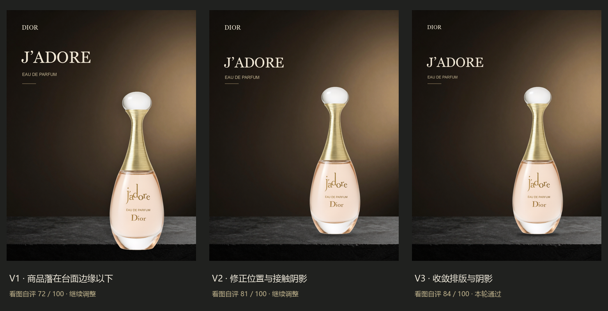

# 首次真实闭环：Dior J'adore

结论：对话引导的三轮闭环已跑通，选第三版作为本轮成品。背景由本机 Z-Image Turbo 生成，商品与文字由 ComfyUI 的 Spec 合成节点执行。Director 与 Critic 是当前对话中的 Codex，看图后写入具体修改，没有调用独立视觉 API。



| 版本 | 看图自评分 | 发现与修改 |
| --- | --- | --- |
| V1 | 72 | 瓶底低于台面前沿；标题偏重；整瓶轮廓投影不提供接触感。 |
| V2 | 81 | 商品上移、略缩小、标题缩小，使用瓶底接触阴影；支撑关系明显改善。 |
| V3 | 84 | 接触阴影收紧、加强，标题/副标题/品牌字号微调；通过本轮原型审阅。 |

评分为主观审阅，不是经过标定的商业质量指标。V2、V3沿用同一背景和同一商品，以隔离布局与阴影修改的作用；第三版的修改幅度明显小于第二版。结果符合本轮流程验证预期，但还不能凭一个案例证明跨商品稳定性。

## 可检查的文件

- `v1/`、`v2/`、`v3/` 分别保存 `PosterSpec.json`、`poster.png`、`Critic.json`。
- `v1/background.png` 是真实生成的背景；生成分辨率 768×1024，最终海报 1024×1360。
- `request.json` 保存任务与三张参考的 ID；`result.json` 保存选择结果和成品哈希。
- `diagnostics/` 保存全黑失败图与排查记录。这些是技术排错样本，未计入三版设计评价。

商品瓶型和标签使用下载原图；只裁掉透明留边来计算商品尺度，没有生成、重绘商品。原图里玻璃的白色环境反射仍保持原样，与深色背景存在轻微拍摄场景差异。本轮未实现商品重打灯或物理玻璃折射，这是下一步画面融合的限制。

参考：Armani Santal Dansha、Tom Ford Black Orchid 静物广告及 Dior 金色 J'adore 海报。只借鉴深色材质、受控灯光与左文字/右商品分区。

## 已验证

- 真实 ComfyUI API 提交、背景生成、透明商品蒙版、文字合成、下载成品。
- 10 项测试：修改白名单与原子性、提前停止、三轮上限、最佳版选择、数据库原图校验、透明留边尺度、接触阴影参数、全黑背景拒绝。
- 修复方式为绕开本地含异常张量的 safetensors 文本编码器，采用已有 GGUF 编码器；未下载大模型。三个阶段的非有限数值会提前报错。

## 复现

从项目根目录运行：

```powershell
.\start_comfy.ps1
python guided_render.py --spec samples/guided/jadore-20260930/v3/PosterSpec.json --output runs/reproduce/poster.png --background samples/guided/jadore-20260930/v1/background.png
```

ComfyUI API 当前运行于 `http://127.0.0.1:8190`。独立自动循环须先配置视觉模型，再使用 `poster.py run --config config.local.json ...`；当前配置尚未填写视觉模型。
