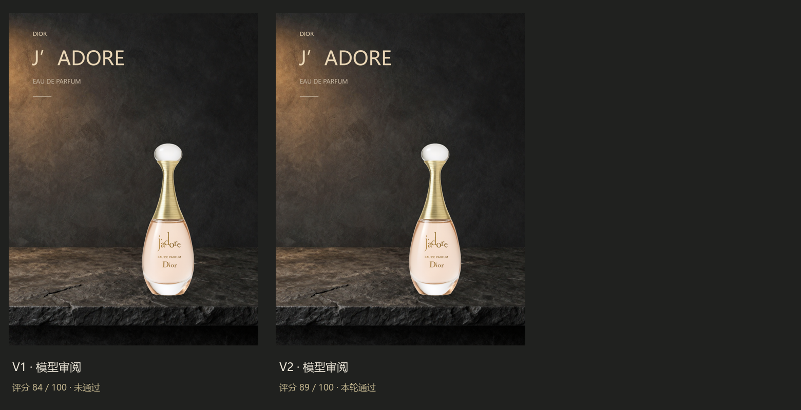

# 首次独立视觉 API 闭环验证

本次使用智谱 `glm-4.6v`，通过 `open.bigmodel.cn` 图片输入完成 Director 和 Critic；ComfyUI 在本机生成背景并按 Spec 合成原商品。API 密钥来自环境变量，未提交。所有记录均来自真实调用；没有人工替换模型的评语、改稿命令或 PASS。

## 开启推理的完整运行



| 版本 | 模型评分 | 判定 | 改稿 |
| --- | --- | --- | --- |
| V1 | 84 | 不通过 | Critic 认为接触阴影离瓶底太远，输出 `shadow.offset_y = 0`。 |
| V2 | 89 | PASS | 无 problems/changes，自动停止。 |

见 [结果](reasoning-pass/result.json)、[Director 调用](reasoning-pass/Director-call.json)、[V1 Critic](reasoning-pass/v1/Critic-call.json) 和 [V2 Critic](reasoning-pass/v2/Critic-call.json)。Director 实际接收 4 张图；Critic 每轮接收成品 + 原商品 + 3 张参考，共 5 张。开启 thinking 的响应确实返回了 reasoning token 用量。

已核对：Director 输出与 V1 Spec 相同；把 V1 Critic 的变化交给 `apply_changes` 后与 V2 Spec 完全相同；模型输出与保存的 Critic 相同；成品 SHA-256 与 result 相同。本次改稿没有改变商品、文案或背景。两版视觉差异主要在接触阴影，未验证“大幅提升审美”。

这证明一个商品、一个方向的独立自动链路完成了，不证明多商品稳定性、四方向竞争或可靠的商业审美评判。评分和 PASS 都是同一个视觉模型的主观评审。瓶内白色摄影反射仍来自原商品图，未实现重打灯或真实折射融合。

## 保留的未通过与中止记录

- [未开启推理的三轮](no-thinking-needs-review/result.json)：三版均 72 分，最终 NEEDS_REVIEW。Critic 能指出悬空，但位移命令不足以修复。它使用当时的提示词；与成功运行的 brief、提示词、几何辅助也不同，不能把改善单独归因于 thinking。
- [首次格式失败](diagnostics/format-failure/failure.json)：Director 照搬模板，Critic 用 answer 包装；严格顶层校验中止。之后移除示例中的发布声明、强调模板仅表示字段结构，并只兼容单层 answer 包装，原有校验保持有效。

## 复现

按根 README 配置 ComfyUI 与 `config.zhipu.example.json`，设置 `ZHIPU_API_KEY`，使用 [成功运行的 request](reasoning-pass/request.json) 中 brief 调用 `poster.py run`。模型是随机生成，重新运行不保证得到相同评语或 PASS。复现当前成品可直接使用保存的 Spec 与背景：

```powershell
python guided_render.py --spec samples/live/jadore-20261001/reasoning-pass/v2/PosterSpec.json --output runs/reproduce/live-v2.png --background samples/live/jadore-20261001/reasoning-pass/v2/background.png
```

接入后的本地测试：14 项通过，涵盖多图请求、选项约束、调用留档、截断拒绝、包装兼容、几何坐标以及原有修改/轮次规则。
