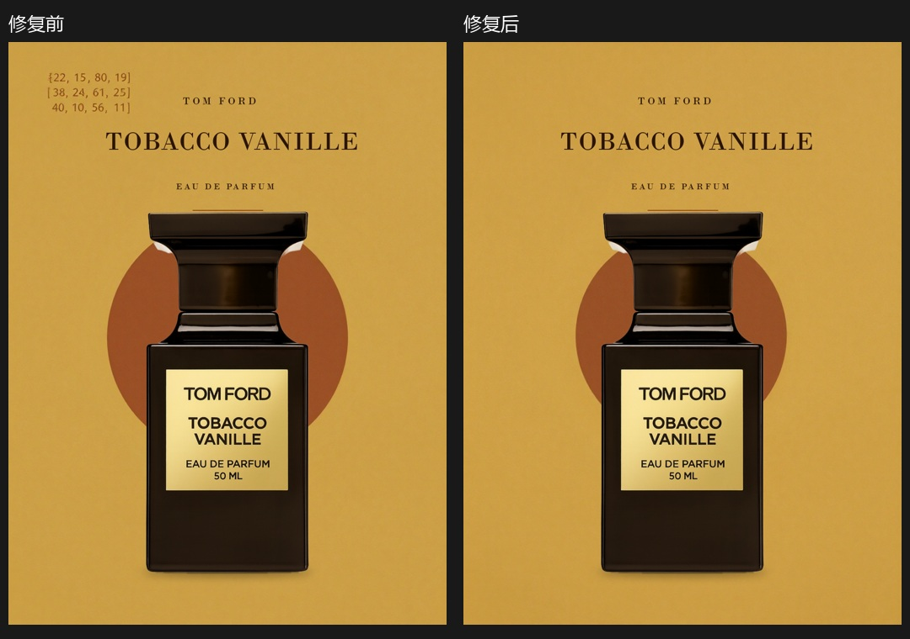

# 背景坐标泄漏修复

相同商品、PosterSpec 和随机种子复测；仅更改背景位置提示的构造方式。

- 修复前：背景左上角出现三行坐标数组。视觉 Critic 识别到问题，但背景生成器每次又被追加同样的数组，修改背景描述无法从根源消除问题。
- 修复后：将实际合成区域转换为自然语言方位，精确像素坐标仍由合成程序执行。本次真实 ComfyUI 输出中已无坐标文字，人工看图确认。
- 模型评分由 71.9 变为 78.1，仅作为评审记录；两张均为 NEEDS_REVIEW，仍存在装饰线贴近瓶盖、文字间距和圆形位置问题。
- 此案例验证一个具体故障修复，不代表所有背景都不会生成伪文字，也不代表产品审美稳定。

原始 PNG、完整评审、背景实际提示、相同输入校验均保存在本目录。批量 15 款的既有进程使用旧引擎快照，该批次不应计为此修复的验证。
