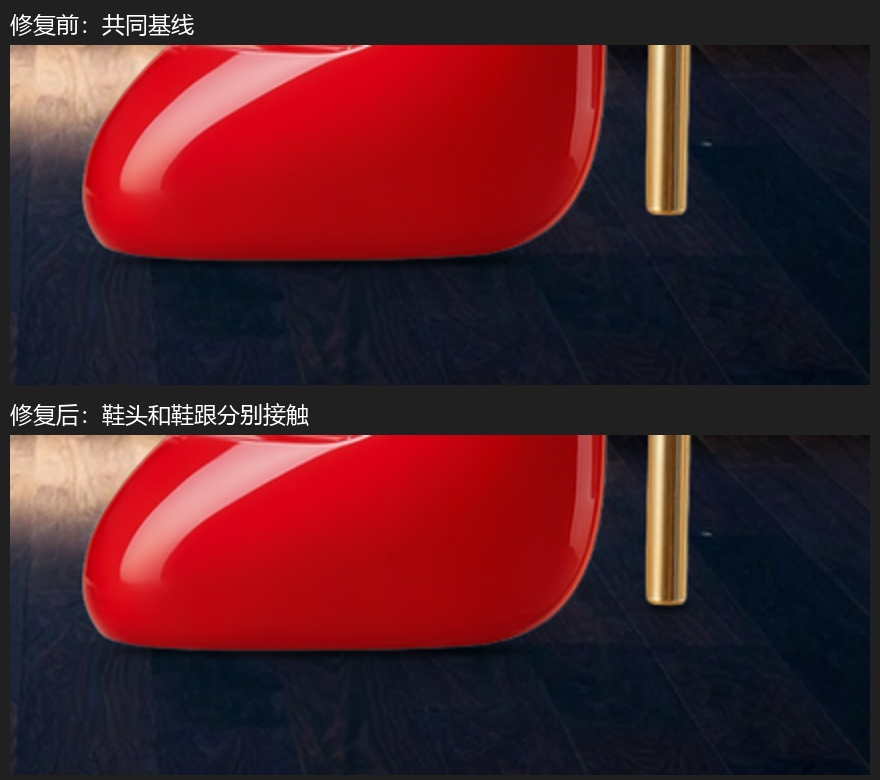

# 鞋形瓶多接触点回归

该商品的鞋头与鞋跟底部高度不同。旧算法仅在整张商品图的最低位置测量一条轮廓，遗漏稍高的鞋跟；阴影偏移再小也无法补出第二个支撑点。

新算法在底部区域识别分离的支撑轮廓，再分别计算接触位置与阴影。该样例测得鞋头和鞋跟两个支撑点，修改仅影响鞋跟附近的阴影像素。

这里是同一 Spec、同一背景下的本地确定性合成对照：前图将接触算法切回旧算法，后图使用新算法。不是新一轮 ComfyUI 或视觉评审，也不将本地重放声称为原始 PNG 的逐像素复现。实际校验见 verification.json；整体光线与地面透视仍需完整补测。

