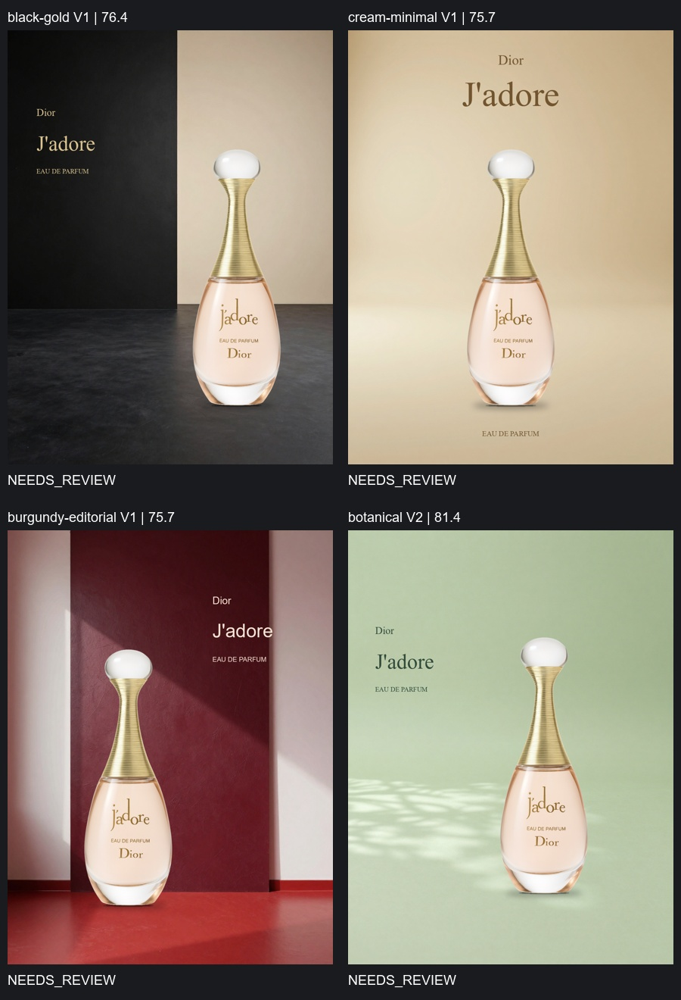

# J’adore 四风格质量迭代 — 2026-10-01

这次由 GLM-4.6V 独立担任 Director/Critic，真实调用本地 ComfyUI 生成背景与商品原图合成。共三批，每批四个方向；没有人工替换单张 PosterSpec 或人为授予 PASS。配置预算为每方向最多 5 版，重复 Spec、无有效修改、不可恢复错误会提前停止。

**最终批次四张全部可交付查看，但全部 NEEDS_REVIEW。没有验证出稳定的商业成片，也没有证据证明每次修改都提升审美。**

| 批次 | 方向 | 实际版本数 | 所选版本 | Critic 均分 | 状态 |
|---|---|---:|---|---:|---|
| trial-1 | black-gold | 1 | V1 | 77.1 | NEEDS_REVIEW |
| trial-1 | cream-minimal | 1 | V1 | 75.7 | NEEDS_REVIEW |
| trial-1 | burgundy-editorial | 2 | V1 | 77.1 | NEEDS_REVIEW |
| trial-1 | botanical | 1 | V1 | 75.7 | NEEDS_REVIEW |
| trial-2 | black-gold | 3 | V1 | 77.1 | NEEDS_REVIEW |
| trial-2 | cream-minimal | 3 | V1 | 75.7 | NEEDS_REVIEW |
| trial-2 | burgundy-editorial | 3 | V1 | 77.1 | NEEDS_REVIEW |
| trial-2 | botanical | 3 | V2 | 81.4 | NEEDS_REVIEW |
| trial-3 | black-gold | 2 | V1 | 76.4 | NEEDS_REVIEW |
| trial-3 | cream-minimal | 2 | V1 | 75.7 | NEEDS_REVIEW |
| trial-3 | burgundy-editorial | 3 | V1 | 75.7 | NEEDS_REVIEW |
| trial-3 | botanical | 3 | V2 | 81.4 | NEEDS_REVIEW |

## 解决的具体问题

商品名称先从商品图与用户 Brief 单独读取，四个 Director 共用同一组字样。这三批所选图片均为 Dior / J’adore / EAU DE PARFUM，价格留空，没有再使用“香氛”占位标题。身份来自模型识别与 Brief，不是独立品牌认证。

增加可执行的字体白名单。非法的组合修改仍首先整体拒绝并尝试一次模型修复；修复失败时，保留独立安全的商品/文字/阴影/背景修改组，所有保留和拒绝都有审计。第三批保持奶油居中和真实瓶底接触位置，避免前两批模型造成的标题偏移、阴影下移空隙。

背景文字约束排除展台、台面和底座；softbox 名称替换为光线效果。第一批黑金出现瓶子浮在展台前，第二批出现实际柔光箱；第三批所选黑金未出现这些物体。它们都保留在历史记录中，未隐藏失败图。

Critic 同时查看全图、原商品、三张参考及瓶底放大区域。最终选图直接看各版作品，不提供分数，且永远不能授予 PASS。第三批黑金、奶油、酒红均选回 V1；植物方向模型选了不存在的候选编号，程序拒绝并记录后回退到分数最高的 V2。这也说明视觉选择仍不够可靠。

## 成品审阅与局限

人工看过最终四张：字样正确、无明显越界、没有摄影设备露出；奶油和植物方向的瓶底比被错误移动阴影的中间版本更稳。但四方向依然以“独立背景 + 同一明亮商品原图 + 文字”表达，概念与品牌叙事单薄，商品照明与环境反射并未真实联动。黑金的明亮瓶身与暗地面仍有拼贴感；酒红的几何背景更多是空摄影布景，字体也未形成有辨识度的编辑系统。

Critic 经常重复阴影/居中偏好，曾把正确的 offset_y=0 解释为不在 -2..0 范围内。放大细节与显式几何仍未消除这些误判。相对选优理由也较泛，不应视为独立质量认证。下一步真正的质量瓶颈是可控环境光与材质交互、每个方向的创意概念，以及视觉评审校准；继续增加轮数不能保证解决它们。

## 证据与复现

`trial-*/batch` 保存批次请求、商品字样与结果；每个方向保留各版图片、背景尝试、PosterSpec、API 调用响应/用量/图片摘要、Critic 与修改审计。`verification-summary.json` 用最终规则回查三批所选图片；前两批的错误会被保留。第三批四张的安全布局与背景检查为空，字样一致，成品 SHA-256 与选择记录一致；这些检查不构成审美 PASS。

`trial-3/engine` 为最终批次冻结的三个源码文件，与运行结束后项目源码逐字节一致。真实生成使用项目程序驱动原有 ComfyUI；本轮生成时 ComfyUI 合成函数与新源码完全一致，新的协调逻辑于运行结束后加载进 ComfyUI 节点。

56 项自动检查通过，覆盖越界/原子修改、字符覆盖、接触阴影、居中误移、安全组恢复、直接选优与失败回退、重复 Spec 停止和超过三版的质量预算。原有三版脚本演示仍保持独立标记，不能用于证明 AI 审美闭环。
