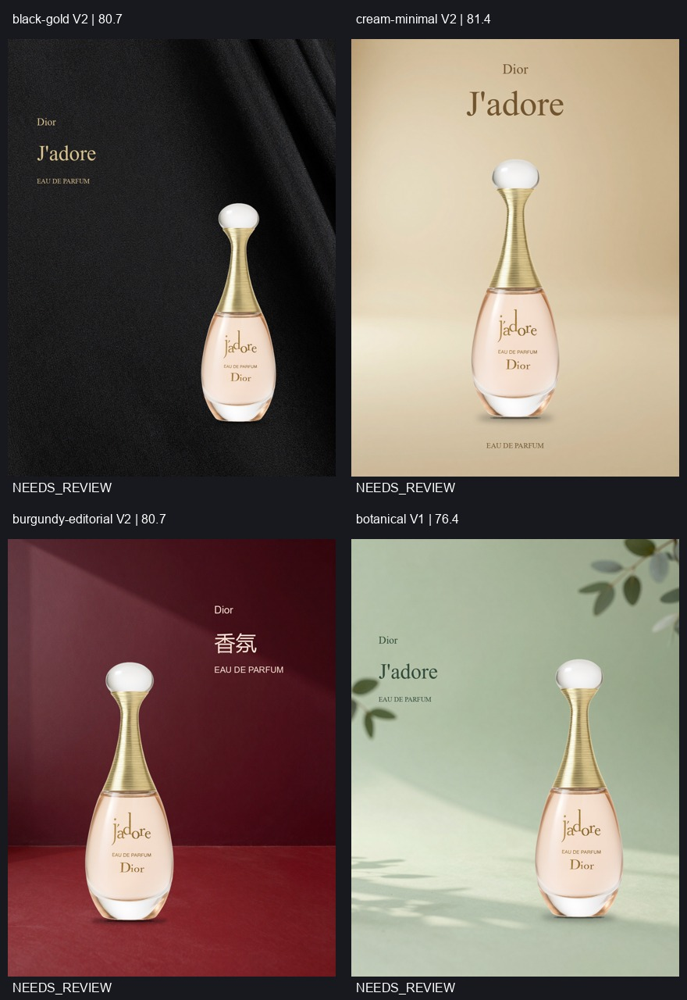

# 自动闭环稳定性加固验收（2026-10-01）

最新第 7 批：4/4 成品可预览；商品边距、文字间距和分组对齐、字体覆盖、明显白边、平均对比度检查全部通过。四张仍为 NEEDS_REVIEW，不能称为稳定商业成片。

所有批次通过真实 ComfyUI 的 LoadImage → PerfumeDirectorLoop 提交。GLM-4.6V 独立规划与评审，Z-Image 生成背景，ComfyUI 合成商品原图与文字。未人工修改各批 PosterSpec 或成品，也未人工替换程序选中版本。程序的布局、字色和字形修复均有记录。

## 修复与证据

- 矛盾 PASS 保守降级；缺少维度只要求一次重新评审，不造分数。
- 临时连接问题有限重试；评审失败保留海报和空评分；危险修改原子拒绝并允许一次安全修复。
- 四方向选择适合色系的三品牌参考；检查实际商品范围、文字间距与分组对齐。
- 背景检测常量图、窄白框与双侧白边；失败重生，备用背景显式标记且禁止 PASS。
- 文字按实际背景调整字色；字体缺字先由 Director 选可覆盖的配置字体，Renderer 拒绝方框输出。
- 接触阴影增加贴近商品实际底部的核心阴影；原商品保持原图合成。

43 项自动检查通过，包含真实旧失败记录回放、断连恢复/耗尽、错误分类、危险布局与间距、对齐组、白边、中文字形、评审失败仍保留成品等。

## 全部调试批次

以下检查用最终规则回查每批的程序选中版本，0 表示无该类问题。保留失败和漏检，不能把它们算成通过。每批的 revision/source hash 可能不同，是调试记录，并非七次同版本认证。

| 批次 | 结果 | 可预览 | 布局问题 | 背景问题 | 字体问题 | 对比度问题 | 审美 PASS |
|---|---|---:|---:|---:|---:|---:|---:|
| [1](batch-1/verification.json) | COMPLETED | 4/4 | 0 | 0 | 0 | 0 | 0 |
| [2](batch-2/verification.json) | COMPLETED | 4/4 | 2 | 0 | 0 | 0 | 0 |
| [3](batch-3/verification.json) | PARTIAL | 3/4 | 0 | 0 | 0 | 0 | 0 |
| [4](batch-4/verification.json) | COMPLETED | 4/4 | 0 | 1 | 0 | 0 | 0 |
| [5](batch-5/verification.json) | COMPLETED | 4/4 | 0 | 1 | 0 | 0 | 0 |
| [6](batch-6/verification.json) | COMPLETED | 4/4 | 0 | 0 | 1 | 0 | 0 |
| [7](batch-7/verification.json) | COMPLETED | 4/4 | 0 | 0 | 0 | 0 | 0 |

第 3 批酒红 Director 返回 HTTP 400，原记录未保存服务方错误体，因此原因未确认；[同请求的视觉诊断回放](http400-replay/verification.json)成功返回有效规划，诊断没有提交渲染。后续已增加错误码记录及仅对未分类 400 的一次重试，明确带错误码的拒绝停止。不能声称该偶发错误的根因已经消除。

第 2 批副标题贴近商品、文字组未同步；第 4/5 批双侧白边漏检；第 6 批中文缺字。它们分别触发新增回归检查，最新批次全部拦截/修正。

## 最终使用方式与限制

刷新本地 http://127.0.0.1:8190/，原四方向工作流可继续运行。当前配置见 config.zhipu.example.json：关闭深度思考、temperature 0.2、1280 像素多图输入，所有服务调用有超时与有限重试。

这是同一款香水和同一 Brief 的小规模验证。尚未证明其他商品、任意长文案、不同机器/字体或长期服务可用性。模板化构图、商品重打光和背景物理融合仍有提升空间；Critic 的一些解释仍不准确，分数不能替代人的最终审美验收。

每个目录保留真实提交、状态、request、Director/Critic 原响应、各版海报、背景尝试、执行 Spec 和最终选择。verification.json 的相对路径与 SHA-256 可验证图片；job-state 中原始绝对路径仅为本机运行溯源。最新程序与运行时文件的相同字节 hash 在 verification-summary.json。
